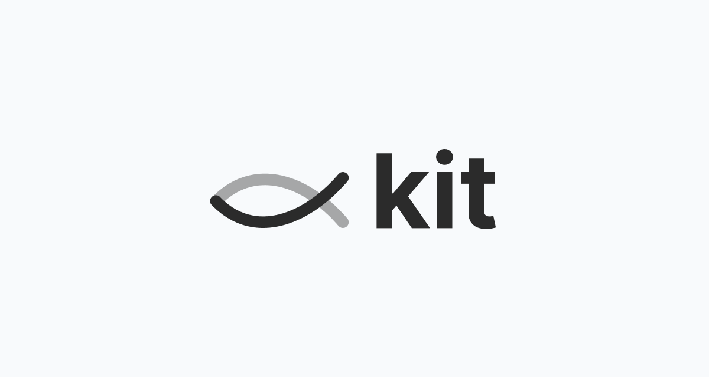

# kit (Keep in Touch)

With kit (Keep in Touch), staying engaged with your users and promoting your product has never been easier.
[Open kit](https://kit.faith.tools)



## Things to know

- Created via the Astro-based [Freedom Stack](https://github.com/cameronapak/freedom-stack) boilerplate. Visit that boilerplate for more information on how to use it and how to use this project.
- This project is deployed to Netlify.

What you get:

- Your own blog with an RSS feed
- A simple way to capture email leads
- A simple landing page/overview of the tool you're creating
- Products with a kit page are promoted on [faith.tools](https://faith.tools) to help showcase movement of Christians in tech

## Local Development

### Prerequisites

You'll need the following:

- Clerk API key (for authentication)
- Turso API key (for the database)
- Cloudinary API key (for image uploads)

### 1. Clone the repository

```bash
git clone https://github.com/cameronapak/kit.git
```

### 2. Install dependencies

Must be using Node.js v20.3.0 or higher.

```bash
npm install
```

### 3. Set environment variables

Copy the `.env.example` file to `.env` and populate the variables.

```bash
cp .env.example .env
```

### 5. Run the development server

```bash
npm run dev
```

## Attribution License

See [LICENSE.md](./LICENSE.md) for more information.

## Contributing

Create a fork of this repository, make your changes, and submit a pull request.

## Questions?

Feel free to reach out to me on [X](https://x.com/cameronpak) if you have any questions!
